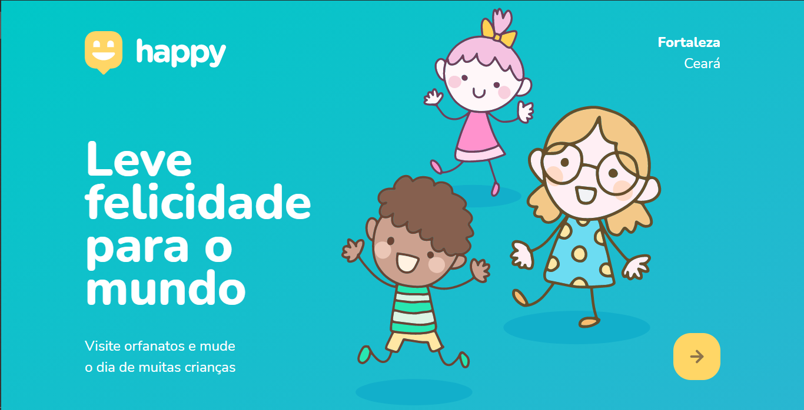
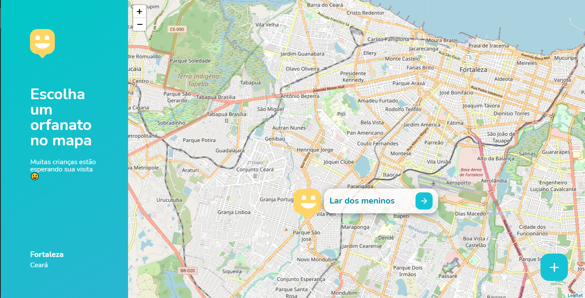
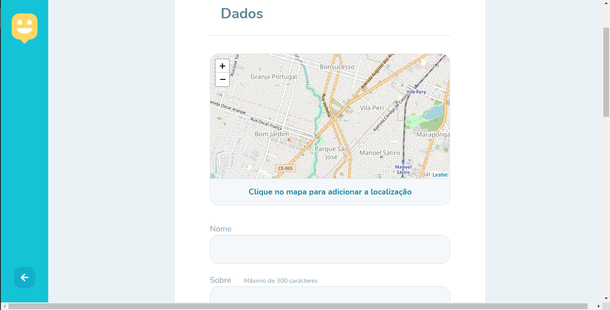

# Projeto Next Level Week #3
#### Esse foi um projeto orgulhosamente criado durante a terceira next level week, bootcamp prestado pela <b>Rocketseat</b>. 

## Sumário

- [Imagens](#Imagens)
- [Instalação](#instalação)
- [Sobre/Uso](#Sobre/uso)

## Imagens

## Instalação

Clone esse repositório na sua pasta local

`git clone https://github.com/alvaropsouza/nextLevelWeek03.git`

Instale as dependências utilizadas no projeto

`npm install`

Inicie o servidor

`npm start`

Agora basta abrir no seu navegador uma aba com o seguinte endereço:

`http://localhost:5500/` (<i>Endereço que consta no server.js</i>)
## Sobre/Uso

O projeto Happy foi criado com o intuito de fazer um catálogo de orfanatos próximos de você, para que possa então ser feito o agendamento de visitas às crianças.

## Contributing

Por favor, contribua usando o github flow [Github Flow](https://guides.github.com/introduction/flow/). Crie uma branch, adicione commits e [Abra um pull request](https://github.com/fraction/readme-boilerplate/compare/).
